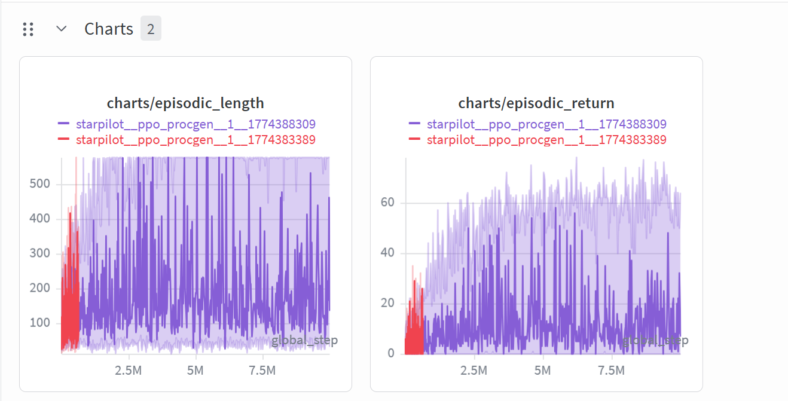
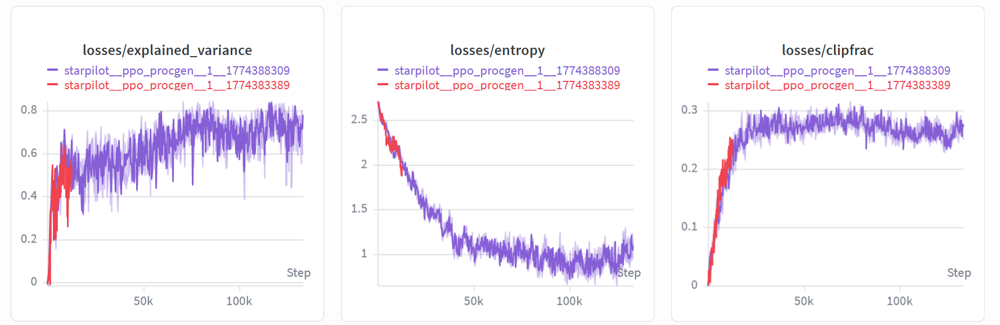

# Deep Visual Reinforcement Learning Agent

[](https://wandb.ai/<your-entity>/<your-project>)
[](https://wandb.ai/<your-entity>/<your-project>/reports/<your-report>)
[](https://wandb.ai/<your-entity>/<your-project>/sweeps)

<p align="center">
  <video width="960" controls muted loop playsinline>
    <source src="assets/StarPilot_Expert_Agent.mp4" type="video/mp4">
    Your browser does not support the video tag.
  </video>
</p>
<p align="center">
  <a href="assets/StarPilot_Expert_Agent.mp4">Open demo video directly</a>
</p>

This repository contains a custom implementation of a PPO-based vision agent focused on applied reinforcement learning for visual control. The agent is trained end-to-end on raw-pixel inputs to navigate procedurally generated environments, featuring automated hyperparameter sweeps and reproducible evaluation workflows.

## Key Highlights

- Orchestrated PPO-based vision agent training for 10M+ environment steps on raw-pixel inputs; achieved a 75% success rate on the StarPilot benchmark for autonomous navigation.
- Implemented 4-frame temporal stacking to resolve partial observability, generating a 45% reward increase via velocity and direction inference from sequential image data.
- Automated experimentation via Weights & Biases for 50+ hyperparameter sweeps; streamlined training iteration cycles by 60% through modular pipeline architecture.

## Architecture

The agent uses an actor-critic PPO objective with an Impala-style convolutional encoder and temporal context aggregation for policy learning from vision.

| Component | Configuration | Purpose |
| --- | --- | --- |
| Input observations | `64x64x3` RGB frames | Preserves high-information visual state directly from the environment |
| Visual encoder | Impala CNN with residual blocks (`ResidualBlock`, `ConvSequence`) | Learns robust spatial representations under procedural variability |
| Temporal context | 4-frame stacking (`t-3` to `t`) | Provides motion and trajectory cues from sequential image dynamics |
| Policy head | Categorical actor over discrete actions | Outputs navigation actions for StarPilot control |
| Value head | Scalar critic | Estimates state value for PPO advantage learning |

### Impala CNN for Spatial Feature Extraction

The network backbone follows the Impala CNN pattern: convolution, downsampling, and residual blocks repeated across stages. This architecture improves representation quality and optimization stability when learning from high-dimensional visual observations.

### 4-Frame Temporal Stacking Logic

At each policy step, the pipeline constructs state from the four most recent frames. This temporal window allows the model to infer direction, relative speed, and short-horizon trajectories that are not observable from a single image.

## Repository Structure

| Path | Description |
| --- | --- |
| `cleanrl/ppo_procgen.py` | Core training engine with temporal stacking and Impala CNN |
| `cleanrl_utils/` | Utilities for W&B tracking and hyperparameter sweeps |
| `record_hd.py` | Custom evaluation script for HD rendering and inference of the trained `.cleanrl_model` |
| `streamlit_app.py` | Interactive dashboard for run analysis |
| `assets/` | Contains the pre-trained weights and demo footage |

## Quick Start

### 1) Environment Setup

```bash
python -m venv .venv
# Linux/macOS
source .venv/bin/activate
# Windows PowerShell
# .venv\Scripts\Activate.ps1

pip install -r requirements.txt
pip install -r requirements/requirements-procgen.txt
```

### 2) Run Evaluation

```bash
python record_hd.py
```

### 3) Launch Training

```bash
python cleanrl/ppo_procgen.py \
  --env-id starpilot \
  --total-timesteps 10000000 \
  --track \
  --wandb-project-name <your-project> \
  --wandb-entity <your-entity>
```

## Screenshots





## Acknowledgements

Architecture base: core PPO algorithms adapted from the CleanRL library, modified for custom temporal stacking and Impala CNN feature extraction.
